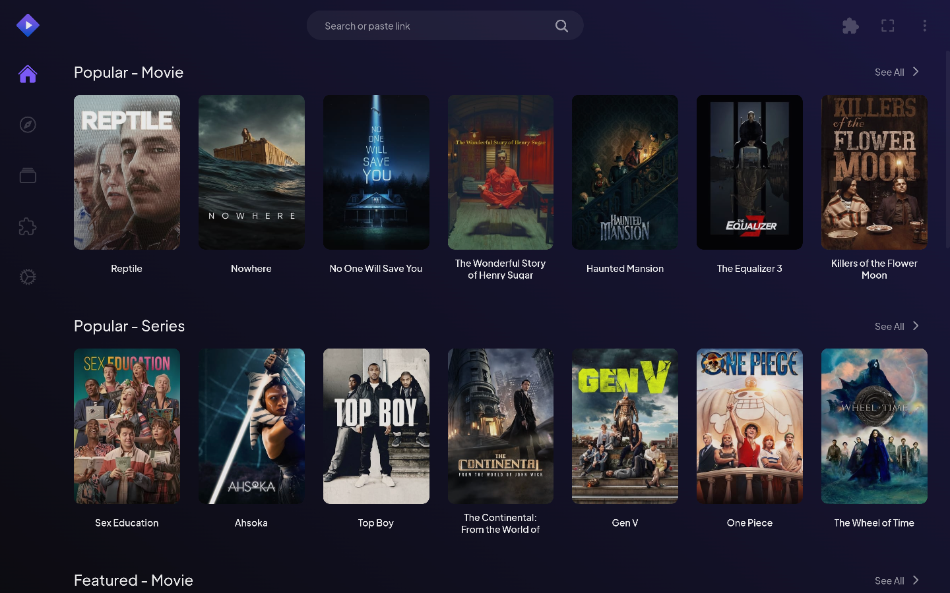

<!--
Ohart ongi: README hau automatikoki sortu da <https://github.com/YunoHost/apps/tree/master/tools/readme_generator>ri esker
EZ editatu eskuz.
-->

# Stremio YunoHost-erako

[](https://ci-apps.yunohost.org/ci/apps/stremio/)  

[](https://install-app.yunohost.org/?app=stremio)

*[Irakurri README hau beste hizkuntzatan.](./ALL_README.md)*

> *Pakete honek Stremio YunoHost zerbitzari batean azkar eta zailtasunik gabe instalatzea ahalbidetzen dizu.*  
> *YunoHost ez baduzu, kontsultatu [gida](https://yunohost.org/install) nola instalatu ikasteko.*

## Aurreikuspena

Stremio is a modern media center that's a one-stop solution for your video entertainment. You discover, watch and organize video content from easy to install addons.

**Paketatutako bertsioa:** 5.0.0~ynh1

**Demoa:** <https://demo.example.com>

## Pantaila-argazkiak



## Dokumentazioa eta baliabideak

- Aplikazioaren webgune ofiziala: <https://example.com>
- Erabiltzaileen dokumentazio ofiziala: <https://yunohost.org/apps>
- Administratzaileen dokumentazio ofiziala: <https://yunohost.org/packaging_apps>
- Jatorrizko aplikazioaren kode-gordailua: <https://github.com/Stremio/stremio-web>
- YunoHost Denda: <https://apps.yunohost.org/app/stremio>
- Eman errore baten berri: <https://github.com/YunoHost-Apps/stremio_ynh/issues>

## Garatzaileentzako informazioa

Bidali `pull request`a [`testing` abarrera](https://github.com/YunoHost-Apps/stremio_ynh/tree/testing).

`testing` abarra probatzeko, ondorengoa egin:

```bash
sudo yunohost app install https://github.com/YunoHost-Apps/stremio_ynh/tree/testing --debug
edo
sudo yunohost app upgrade stremio -u https://github.com/YunoHost-Apps/stremio_ynh/tree/testing --debug
```

**Informazio gehiago aplikazioaren paketatzeari buruz:** <https://yunohost.org/packaging_apps>
