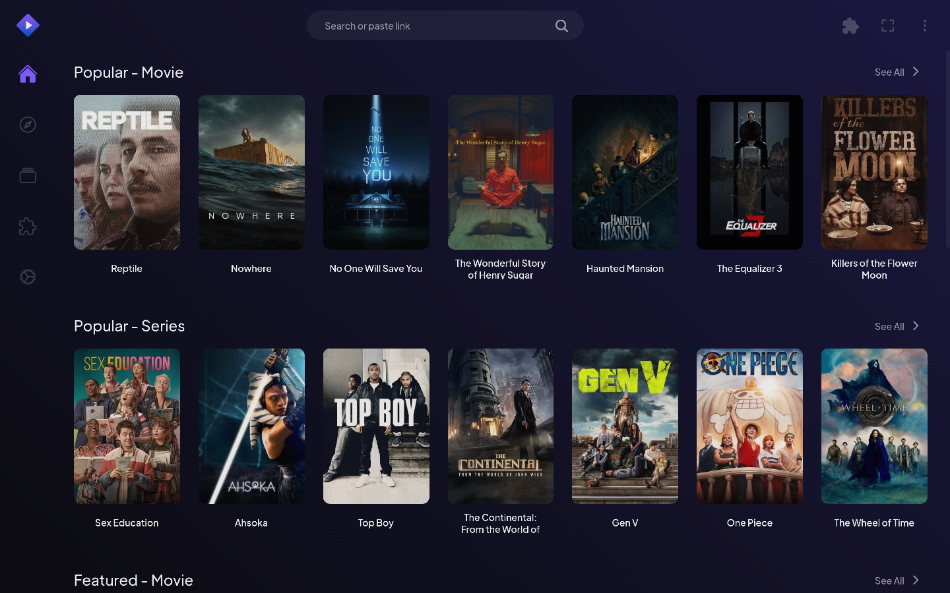

<!--
NOTA: Este README foi creado automáticamente por <https://github.com/YunoHost/apps/tree/master/tools/readme_generator>
NON debe editarse manualmente.
-->

# Stremio para YunoHost

[](https://ci-apps.yunohost.org/ci/apps/stremio/)  

[](https://install-app.yunohost.org/?app=stremio)

*[Le este README en outros idiomas.](./ALL_README.md)*

> *Este paquete permíteche instalar Stremio de xeito rápido e doado nun servidor YunoHost.*  
> *Se non usas YunoHost, le a [documentación](https://yunohost.org/install) para saber como instalalo.*

## Vista xeral

Stremio is a modern media center that's a one-stop solution for your video entertainment. You discover, watch and organize video content from easy to install addons.

**Versión proporcionada:** 5.0.0~ynh1

**Demo:** <https://demo.example.com>

## Capturas de pantalla



## Documentación e recursos

- Web oficial da app: <https://example.com>
- Documentación oficial para usuarias: <https://yunohost.org/apps>
- Documentación oficial para admin: <https://yunohost.org/packaging_apps>
- Repositorio de orixe do código: <https://github.com/Stremio/stremio-web>
- Tenda YunoHost: <https://apps.yunohost.org/app/stremio>
- Informar dun problema: <https://github.com/YunoHost-Apps/stremio_ynh/issues>

## Info de desenvolvemento

Envía a túa colaboración á [rama `testing`](https://github.com/YunoHost-Apps/stremio_ynh/tree/testing).

Para probar a rama `testing`, procede deste xeito:

```bash
sudo yunohost app install https://github.com/YunoHost-Apps/stremio_ynh/tree/testing --debug
ou
sudo yunohost app upgrade stremio -u https://github.com/YunoHost-Apps/stremio_ynh/tree/testing --debug
```

**Máis info sobre o empaquetado da app:** <https://yunohost.org/packaging_apps>
